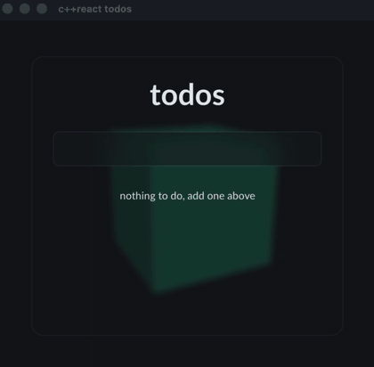

<h1 align="center">c++react</h1>

<p align="center">React in C++, probably for your games, CAD editors or other crazy stuff, like a GUI inside Unreal Engine 5 (I did). Function components, hooks, and a virtual DOM that renders into whatever host you give it. Because your CAD software also deserved a pretty GUI.</p>

<p align="center">
  
  
  
  
  
</p>

<p align="center">
  
</p>

> **Alpha.** c++react is experimental and not recommended for production use yet. Try it, break it,
> and help me sort out the bugs: issues and pull requests are very welcome.

c++react is a C++ library for building user interfaces, with the React model: components, hooks, and
a virtual DOM that updates only what changed. It does not render on its own. You point it at a
host and it drives that, so the same components can run on a browser, a game engine, or anything
else. The [demo](#demo) below uses [RmlUi](https://github.com/mikke89/RmlUi), the great HTML and CSS
like library for C++ that draws through OpenGL and many other targets (and yes, I implemented an
Unreal Engine 5 backend for RmlUi, stay tuned, that will be open sourced too).

What you get:

- the hooks you expect (`use_state`, `use_effect`, `use_memo` and friends, all listed below)
- keyed lists, context, portals, synthetic events
- native elements for the parts that draw their own pixels
- batched rendering: `set_state` queues, `flush` drains it
- no dependencies, C++20, builds with `-fno-exceptions -fno-rtti`

## Using it

c++react is header only. Fetch it and link the target:

```cmake
include(FetchContent)
FetchContent_Declare(cppreact GIT_REPOSITORY https://github.com/geforcefan/cppreact.git)
FetchContent_MakeAvailable(cppreact)

target_link_libraries(your_app PRIVATE cppreact::cppreact)
```

Or copy the `include/` directory into your project, there is nothing to compile.

```cpp
#include "cppreact/cppreact.hpp"
#include "cppreact/hosts/rml.hpp"   // the host you render through
```

## Demo

A demo says more than a thousand words. `demo/` is the todo app from the animation at the top, a
complete desktop app:

- a GLFW window with OpenGL
- RmlUi on top as the host for c++react
- CMake fetches GLFW and RmlUi
- FreeType comes from the system (`brew install freetype` on macOS, `apt install libfreetype-dev` on Linux)

```
cmake -S demo -B demo/build
cmake --build demo/build
./demo/build/todo
```

The demo fetches [my RmlUi fork](https://github.com/geforcefan/RmlUi) instead of upstream: it
carries a couple of bug fixes of mine that are not merged yet (open PRs
[#962](https://github.com/mikke89/RmlUi/pull/962) and
[#965](https://github.com/mikke89/RmlUi/pull/965)).

## Components

A component is a function `VNode(const Object&)`. Wrap it in `FunctionComponent` and use it like
any element, called with props and children:

```cpp
#include "cppreact/cppreact.hpp"

using namespace cppreact;
using namespace cppreact::tags;

const FunctionComponent Counter = [](const Object& props) -> VNode {
  auto label = props.get<std::string>("label", "count");
  std::optional<double> maximum = props.get<double>("maximum");

  auto [count, set_count] = use_state<int>(0);

  auto increment = [=](const Event&) {
    if (maximum && count >= *maximum) return;
    set_count(count + 1);
  };

  return View({{"class", "counter"}},
    Text({}, label, ": ", count),
    View({{"on_click", increment}}, "increment"));
};
```

A click runs the handler and `set_count` re-renders. Components go inside components:

```cpp
const FunctionComponent App = [](const Object&) -> VNode {
  return View({{"class", "app"}},
    Counter({{"label", "left"}}),
    Counter({{"label", "right"}, {"maximum", 10.0}}));
};
```

A component renders the children it was given with `children()`:

```cpp
const FunctionComponent Card = [](const Object&) -> VNode {
  return View({{"class", "card"}}, children());
};

Card({}, Text({}, "inside"));
```

## Elements

These components exist by default: `View`, `Text`, `Input`, `Textarea`, `Image`.

Children are variadic and mix freely: strings and numbers turn into text nodes, elements and
components nest, `nullptr` renders nothing.

```cpp
View({{"class", "row"}},
  "hello",
  42,
  6.5,
  Text({}, "an element"),
  Counter({{"label", "a component"}}),
  nullptr);
```

If you need your own tag names, call `h()` directly:

```cpp
h("chart", {{"class", "wide"}});
```

## Props

Props are an untyped `Object`, so a component can carry anything:

```cpp
View({
  {"class", "row"},
  {"count", 3.0},
  {"on_click", [](const Event&) { submit(); }},
  {"style", {{"width", "50%"}, {"color", "red"}}},
  {"model", RawPayload{model}},
});
```

Read them typed:

```cpp
std::string label_with_fallback = props.get<std::string>("label", "fallback");
std::optional<double> optional_minimum = props.get<double>("minimum");
auto on_change = props.get<void(double)>("on_change", {});
const Value* raw_count = props.get("count");
```

- a `Callback` compares by identity: the same one again changed nothing, a fresh one did
- a `RawPayload` too, c++react never looks inside

## Hooks

Call them at the top of a component, same order every render. Dependencies are a brace list of
`Value`s:

- `{a, b}` reruns when one changed
- `{}` runs once, on mount
- no argument runs every render

### use_state

```cpp
auto [count, set_count] = use_state<int>(0);

set_count(count + 1);
set_count([](const int& value) { return value + 1; });

auto [rows, set_rows] = use_state<Rows>([] { return load_rows(); });
```

The setter takes a value or an updater lambda. It re-renders the component and skips the render
when nothing changed. A call after unmount is ignored. Pass a function as the initial value and it
runs once, on mount.

### use_reducer

A store: the reducer takes the current state and an action and returns the next state, `dispatch`
feeds it one:

```cpp
struct IncrementAction { int amount; };
struct ResetAction {};
using CounterAction = std::variant<IncrementAction, ResetAction>;

int counter_reducer(const int& count, const CounterAction& action) {
  if (const IncrementAction* increment = std::get_if<IncrementAction>(&action)) {
    return count + increment->amount;
  }
  if (std::get_if<ResetAction>(&action)) {
    return 0;
  }
  return count;
}

const FunctionComponent Counter = [](const Object&) -> VNode {
  auto [count, dispatch] = use_reducer<int, CounterAction>(counter_reducer, 0);

  return View({},
    Text({}, count),
    View({{"on_click", [=](const Event&) { dispatch(IncrementAction{10}); }}}, "+10"),
    View({{"on_click", [=](const Event&) { dispatch(ResetAction{}); }}}, "reset"));
};
```

`dispatch` skips the render when the reducer returns an equal state. As with `use_state`, a
function as the initial value runs once, on mount.

### use_effect

```cpp
use_effect([id]() -> CleanupFunction {
  subscribe(id);
  return [id] { unsubscribe(id); };
}, {id});
```

Runs after commit when a dependency changed. The effect returns its cleanup, which runs before the
next run and on unmount. Return an empty `CleanupFunction` when there is nothing to clean up.

### use_layout_effect

Same signature as `use_effect`, runs first in the commit, before the passive effects. For reading
layout right after the tree changed: layout is settled when a layout effect runs, read it without
forcing anything yourself.

### use_memo

```cpp
auto total = use_memo<int>([rows] { return sum(rows); }, {static_cast<double>(rows.size())});
```

Recomputes only when a dependency changed.

### use_callback

```cpp
auto select = use_callback(Callback{[id](const Event&) { open(id); }}, {id});
```

Returns the same `Callback` until a dependency changes, so dependency lists and `memo` see a
stable identity.

### use_ref

```cpp
int& render_count = use_ref<int>(0);
render_count += 1;
```

A mutable value that survives re-renders and does not trigger one.

### use_context

```cpp
const std::string& value = use_context(theme);
```

Reads the nearest provided value, see [Context](#context).

### use_sync_external_store

```cpp
auto paused = use_sync_external_store(
  [](auto on_change) { return store.subscribe(on_change); },
  [] { return store.paused(); });
```

Subscribes to an external store and re-renders when the snapshot changes.
`subscribe(on_change)` returns the unsubscribe.

### References

References come in two forms, and the `ref` prop takes either one directly. The object form is
`ReferenceObject`: copies all point at the same node, `current()` reads it. Hold it in
`use_ref` so it survives re-renders:

```cpp
ReferenceObject reference = use_ref(ReferenceObject{});

return View({{"ref", reference}, {"class", "panel"}}, "...");
```

The function form is a `Callback` taking a `DomNode`. It is called with the node on attach
and with `null_dom_node` on detach:

```cpp
View({{"ref", Callback{[](DomNode node) { ... }}}});
```

References compare by identity: a stable reference of either form never re-fires across
re-renders and lets `memo` bail, an inline one re-fires every render. On unmount an object
reference is only nulled while it still points at the dying node.

`reference.current()` reaches the created node. Anything host-specific, measuring a box,
reading the display density, imperative animation, goes through the node the reference hands you:
resolve it with `Host::native_element(node)` and talk to your toolkit directly.

On an element, `ref` attaches to the created node. On a component, `ref` is just another prop.
The component copies it onto whichever element it wants to expose, without
caring which form it holds:

```cpp
const FunctionComponent Field = [](const Object& props) -> VNode {
  Object inner{{"class", "field"}, {"type", "text"}};
  if (const Value* reference = props.get("ref")) inner.set("ref", *reference);

  return Input(std::move(inner));
};

ReferenceObject reference = use_ref(ReferenceObject{});
Field({{"ref", reference}});
```

A component that ignores its `ref` prop attaches nothing, exactly like a component that ignores any
other prop.

### use_document_event

```cpp
use_document_event("key_down", [cancel](const Event& event) {
  if (event.key == "escape") cancel();
});
```

An event listener on the document. Bound once, always calls the latest handler, removed on unmount.

## Context

```cpp
const auto theme = create_context<std::string>("light");

provide(theme, std::string("dark"), App({}));

const std::string& value = use_context(theme);
```

`provide` publishes a value for its subtree, `use_context` reads the nearest one. A consumer
subscribes to the provider, so when the value changes every consumer re-renders, even behind a
memoized component that skips its own render.

## Lists

Give items a `key`. Add, remove and reorder then keep the matching instances and their state, moving
only what actually moved. The `map` helper turns a range into a list of nodes:

```cpp
View({{"class", "list"}}, map(items, [](const auto& item) {
  return Row({{"key", item.id}, {"label", item.name}});
}));

map(items, [](const auto& item, std::size_t i) {
  return Row({{"key", item.id}, {"index", double(i)}});
});
```

## Conditionals

`when` renders a node only when the condition holds. Pass a node, or a lambda to build it lazily and
skip the work when it is false:

```cpp
View({{"class", "row"}},
  Text({}, label),
  when(expanded, [] { return View({{"class", "detail"}}, "more"); }));
```

## Events

A handler is `void(const Event&)`, wired through a prop named for the event:

- `on_click`
- `on_mouse_down`, `on_mouse_up`, `on_mouse_move`, `on_mouse_over`, `on_mouse_out`
- `on_key_down`, `on_key_up`
- `on_wheel`
- `on_focus`, `on_blur`
- `on_change`

Append `_capture` to listen in the capture phase:

```cpp
View({{"on_click", bubbled}, {"on_click_capture", first}},
  View({{"on_click", pressed}}, "ok"));
```

Capture handlers run on the way down to the target, before it: a click on the inner element runs
`first`, then `pressed`, then `bubbled`.

The `Event` is synthetic and the same on every host. The fields you will actually reach for:

```cpp
struct Event {
  std::string type;
  DomNode target, current_target;
  double client_x, client_y;
  int button;
  bool shift_key, ctrl_key, alt_key, meta_key;
  std::string key;
  std::string value;
  double delta_x, delta_y;
  RawPayload native;

  void prevent_default() const;
  void stop_propagation() const;
};
```

`key` is the pressed key:

- bare characters: `"a"`, `"7"`
- `"enter"`, `"escape"`, `"tab"`, `"delete"`, `"backspace"`
- space is `" "`
- `"arrow_left"`, `"arrow_right"`, `"arrow_up"`, `"arrow_down"`
- `"shift"`, `"control"`, `"alt"`, `"meta"`

`value` is a control's value on change, and `native` carries the raw host event for anything the
fields above do not cover. The rest of the host event surface is there too (`buttons`,
`movement_x`, `code`, `location`, `repeat`, `delta_z`, `delta_mode`, `data`, `related_target`,
`event_phase`, `get_modifier_state`), a host fills what it can.

```cpp
Callback zoom = [set_scale](const Event& event) {
  event.prevent_default();
  set_scale([delta = event.delta_y](double scale) { return scale - delta * 0.001; });
};

return View({{"class", "graph"}, {"on_wheel", zoom}}, children());
```

For a listener on the document instead of an element, see
[use_document_event](#use_document_event).

## Portals

`portal` renders a subtree into a different container:

```cpp
return View({{"class", "row"}},
  Text({}, "row"),
  portal(overlay_layer, Tooltip({{"text", "on top of everything"}})));
```

Context still flows from where the `portal` call sits, not from the target.

## Hosts

c++react renders through a `Host`. One ships with the library, `hosts/html_string.hpp`: an
in-memory tree with `inner_html` and `dispatch_event`, so components can be tested without a UI
toolkit.

```cpp
#include "cppreact/hosts/html_string.hpp"

hosts::HtmlStringHost host;
Container root = host.create_container();
render(View({{"class", "x"}}, "hi"), root);

host.inner_html();   // <view class="x">hi</view>
```

The RmlUi host ships too, in `hosts/rml.hpp`. Construction is the only difference, it mounts
into an element of the document:

```cpp
#include "cppreact/hosts/rml.hpp"

hosts::RmlHost host;
Container root = host.create_container(rml_element);
render(App({}), root);
```

Each host realizes the five tags in its own vocabulary: the RmlUi host maps `image` to RmlUi's
`img` and instances the rest under the library's names, so RCSS selects `view` and `text`
directly.

`set_state` queues a re-render; nothing happens until you call `flush()`, which batches the queued
updates into one render. Call it wherever it fits, a render loop calls it once per frame.

A host may override `update_layout()` to bring its native tree's layout up to date. The commit
calls it once per batch before layout effects run, and only when layout effects are pending. The
RmlUi host updates the owner document there, the html-string host counts the calls in
`layout_updates`. The default is a no-op.

To write your own host, implement `Host`. `hosts/html_string.hpp` is the reference to read.

## Native elements

Some nodes draw their own pixels and have no children to diff: a canvas, a chart. Such an element
implements `NativeElement`, and the host registers its tag as native:

```cpp
struct NativeElement {
  virtual void set_native_property(std::string_view name, const RawPayload& value);
  virtual RawPayload native_reference();
};
```

A component feeds it a `RawPayload` prop (curve samples, a model) and reads a handle back through
a `ref`. c++react only ever moves the `RawPayload`, never a toolkit type.

## License

MIT, see [LICENSE](LICENSE). The test suite is ported from
[Preact's test suite](https://github.com/preactjs/preact/tree/main/hooks/test/browser) (MIT).
